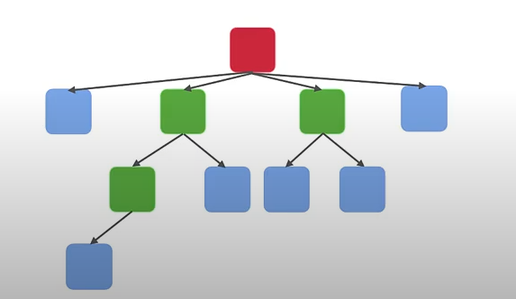
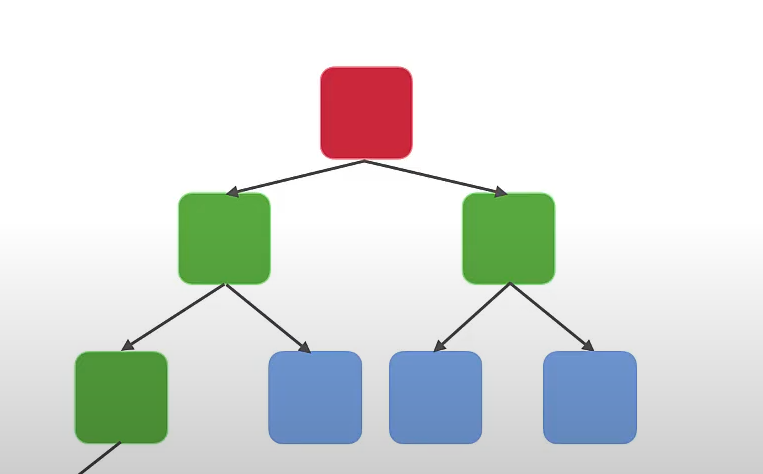
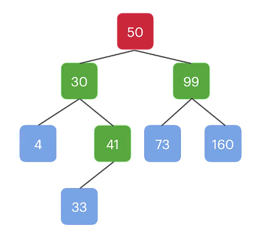

# Trees

A tree is a hierarchical data structure which has a root node, and each node has a parent (if it's not the root) and can have 0 or more child nodes of its own.

A basic example of how a tree is structured would be something like this:



There are multiple types of tree variations, with each tree variation having a specific set of structure or rules.

## Tree

This is the first tree variation and the simplest. As stated above, the tree's rules are as follows:
* It will have one root. If no root exists, the tree is considered empty.
* Each node will have a parent node (unless it's the root).
* A node can have 0-infinity child nodes.

## Binary Tree

A binary tree is the same as a regular tree except the last rule:
* Each node can have between 0 and 2 nodes only. This rule is also applied to the root node.

This is an example for such tree:


## Binary Search Tree

A binary search tree has the same rules as a binary tree, but has additional rules of its own:
* A node will be >= than all of its left children nodes
* A node will be <= than all of its right children nodes

To make it clearer, each node can have 2 children nodes, one right node and one left node.
If we analyze the first rule, it means that a node with a value of 30, all of its children nodes to the left will have a value
which is less than 30 and all of its children to the right has a value which is greater than 30. The reason for that is because the way we use the binary search tree.

We use a binary search tree when we have a lot of data to search from (usually numerical data), which has lesser and greater values.
If we take an array of 10,000,000 elements, and we want to search the element with a value of 57,603, one way to do it is by iterating 
through the entire array until it's found. This can become a large task to perform if the array is that big.

Instead, a binary search tree can cut the processing time by looking at the root node's value (in some cases it would be the middle value since the tree is built from the root down)
and determining if we should go to the left of it (the value we are looking for is smaller than the node's value) or to the right of it (the value is greater than the node's value).
By doing so we are already cutting in half (more or less) the options to iterate through.

We then continue the process for the next node and the one after it and so on, until we reach the node with the desired value.
This is significantly faster than iterating through an array since we are ignoring most of the data in the tree when searching for a specific value.

We can see an example of such tree:




## Binary Tree traversal
Let's say we want to traverse through a binary tree (not necessarily a search tree), First we would need to create this tree:

```javascript
// definition for a binary tree node
function TreeNode(val, left, right) {
   this.val = (val===undefined ? 0 : val)
   this.left = (left===undefined ? null : left)
   this.right = (right===undefined ? null : right)
}

const leftNode = new TreeNode(2);
const rightNode = new TreeNode(3);
const node1 = new TreeNode(1, leftNode, rightNode);
```

In this example we have a simple binary tree with a root, one left node and one right node.
We now want to go over all the nodes of the tree and put their values in a list.

Let's make a function that does so:
```javascript
const inorderTraversal = function(root) {
    if (root === null) {
        return [];
    }

    const result = [];
    if (root.left) {
        result.push(...inorderTraversal(root.left));
    }

    result.push(root.val);

    if (root.right) {
        result.push(...inorderTraversal(root.right));
    }

    return result;
}
```

The ```inorderTraversal``` function's name hints on the type of traversal we will perform on the tree.
An inorder traversal just goes over the tree, starting from the left node, then the root node and then the right node, given the root node as a parameter.

There are multiple ways to traverse through a binary tree:
1. Pre-order traversal - starting from the root, then the left node and then the right node
2. In-order traversal - see example; starting from the left node, then the root node and then the right node
3. Post-order traversal - starting from the left node, then the right node and then the root node

Let's break apart the traversal function above to better understand it. First, we can see that this functions get ```root```
as a parameter, which is a ```TreeNode``` object.
If the node parameter is null, then we return an empty array since there is no value to extract from this node and there are also
no children nodes for this node.

Then we initialize an empty ```result``` array.

We then check if the left node is not null, if it's not null, we apply the left node as a parameter to the same ```inorderTraversal``` function (yep, a recursion)
in order to grab all the values of its nodes as well. Since the value returned is the ```result``` variable, which is an array,
we spread this array and push it to the ```result``` array of the current function call (pay attention that each function call
has its own initialization of the ```result``` array).

We then push the value of the current node to the ```result``` array. As we discussed, we use the "in-order" traversal method
which means that we first check the left node and then the root, and then of course we do the same to the right node as we 
did with the left node by using the ```inorderTraversal``` function on it.

We then return the ```result``` array. We should now have an array with all the values of the tree:

```shell
[ 2, 1, 3 ]
```

These numbers correspond to the tree structure we created earlier:
```javascript
const leftNode = new TreeNode(2);
const rightNode = new TreeNode(3);
const node1 = new TreeNode(1, leftNode, rightNode);
```

We are seeing 2 as the first element in the array, since we performed an in-order traversal, which takes the value of the left
node first, then the first node (value of 1) and then the right node.

## Inserting nodes into a binary search tree

After understanding how a binary search tree works, we can now apply those rules when inserting new nodes into that tree.

First we will create a Node entity:

```javascript
class Node {
    constructor(data, left = null, right = null) {
        this.data = data;
        this.left = left;
        this.right = right;
    }
}
```

This Node entity will act as our tree nodes, so each time we insert a value to the tree, it will be this Node class.

Now we will create the tree class. This class will hold the entire tree with all of its nodes:

```javascript
class BST {
    constructor() {
        this.root = null;
    }

    insert(data) {}
}
```

So far this class does nothing except initializing the root to null, and declaring the ```insert``` method. This method 
will be the one to handle any insertion of nodes into that tree, so this is what we will build now.

First we create a ```Node``` entity based on the data,
then we check if the tree is empty by checking if the root is null:

```javascript
insert(data)
{
    const node = new Node(data);

    // If root is null, then tree is empty. Insert node as root.
    if (this.root === null) {
        this.root = node;
        return;
    }
}
```
If the root is empty, we simply insert the created node as the root and there is nothing else left to do, so we return from
the function.

If the root is already populated, we then need to traverse through the tree, starting from the root, and search for the right
place on the tree to put the new node:

```javascript
insert(data) 
{
    const node  = new Node(data);

    // If root is null, then tree is empty. Insert node as root.
    if (this.root === null) {
        this.root = node;
        return;
    }

    let current = this.root;
    while (true) {
        // if data is more than current node, go right to the next node
        if (data > current.data) {
            // If right child is null, insert node here
            if (current.right === null) {
                current.right = node;
                return;
            }
            current = current.right;
        } else {
            // If left child is null, insert node here
            if (current.left === null) {
                current.left = node;
                return;
            }
            current = current.left;
        }
    }
}
```

We loop through the tree's nodes in order to find the correct place for the new node. We check the new node's value against
the current node on the tree in order to determine if we need to traverse left or right.

If we decide to traverse left and the left node in the tree is already populated, we set the current node to be the left node. 
This will let us repeat the process again, only this time the current node is the left node, so we check again if the new node's value is greater
or lesser than the current node, and we either set the new node's value into the current node's left or right (if it's null), or continue
traversing through the nodes.

This is all we need to do in order to insert nodes into a binary search tree. We
can test that the insertion works by running this example code:

```javascript
let bst = new BST();
const nodes = [10, 5, 15, 0, 20];
nodes.forEach(node => bst.insert(node));

console.log(bst);
```